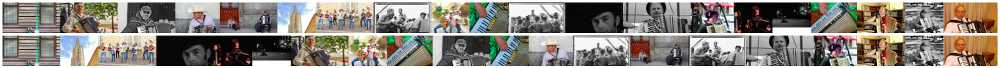

### Intent-Aware-Diversification

Beyond Concept Detection: The Potential of User Intent for Image Retrieval

### Example



### Initialize

Install tensorflow: [tensorflow](https://www.tensorflow.org/install/)

```python
git clone project-uri
pip install -r requirements.txt
```

### Rational

Behind each photographic act is a rationale that impacts the visual appearance of the resulting photo. Better understanding of this rationale has great potential to support image retrieval systems in serving user needs.

However, at present, surprisingly little is known about the connection between “what” a picture shows (the literally depicted conceptual content) and “why” that picture was taken (the photographer intent).

In this paper, we investigate photographer intent in a large Flickr data set.

First, an expert annotator carries out a large number of iterative intent judgments to create a taxonomy of intent classes.

Next, analysis of the distribution of concepts and intent classes reveals patterns of independence both at a global and user level.

Finally, we report the results of experiments showing that a deep neural network classifier is capable of learning to differentiate between these intent classes, and that these classes support the diversification of image search results.
